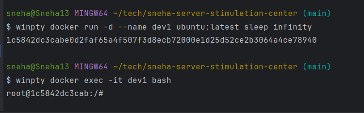
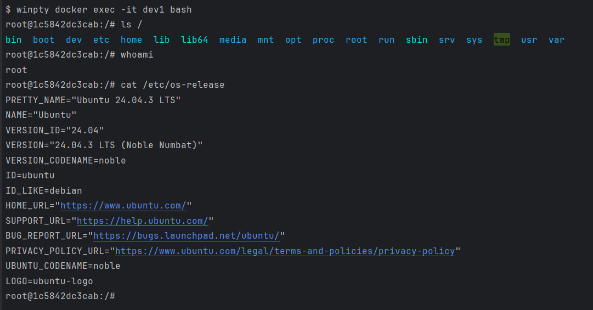
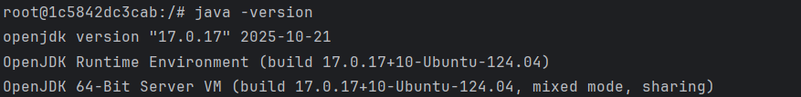
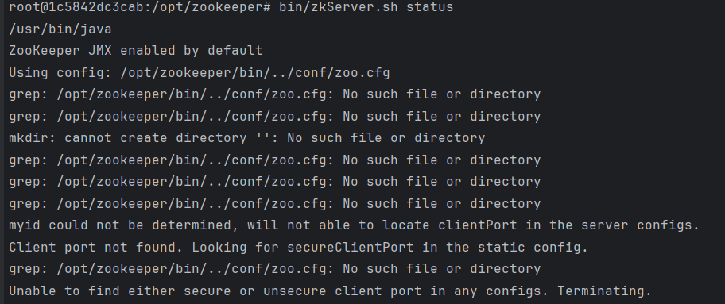
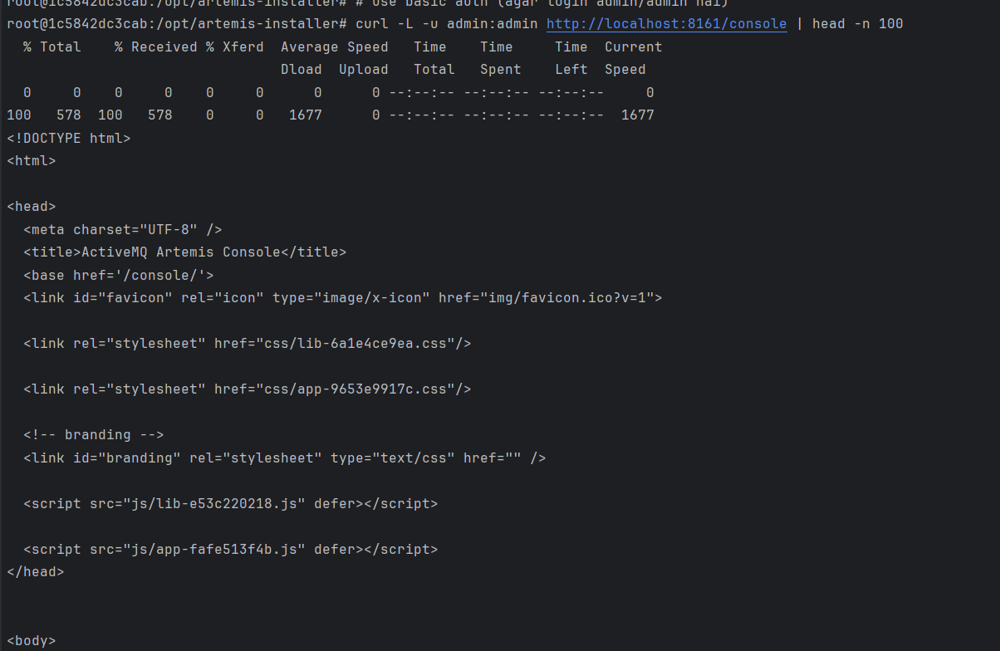
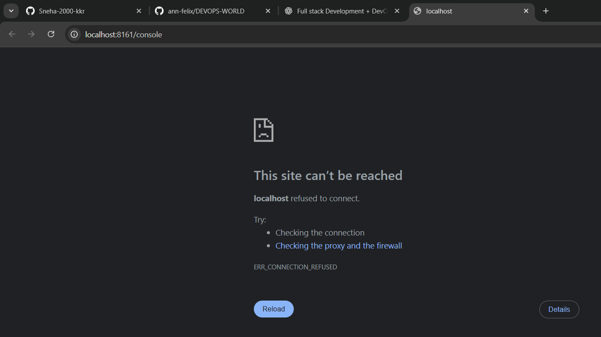

dev1 image is already pushed on Docker Hub : https://hub.docker.com/repositories/snehakkr00

1. pulled ubuntu image in docker images inside docker desktop gui
2. run the image, it will create a container for u and yaha pe apne container ko name do like DEV1
3. list docker images with 
   `docker images`
4. and docker containers with
   `docker ps -a`
5. container names are case-sensitive 
6. how to create n start a new container because with foreground cmd container exit ho jaega turant
so we are making it sleep infinitely 

7. sanity checks inside docker container server

8. update package list `apt-get update`
9. Install basic tools (utility packages) `apt-get install -y curl wget vim unzip git net-tools iputils-ping lsof`
10. Install Java (OpenJDK 17) `apt-get install -y openjdk-17-jdk`

11. Install Gradle (latest version) `wget https://services.gradle.org/distributions/gradle-8.7-bin.zip`
12. Unzip into /opt/gradle `unzip gradle-8.7-bin.zip -d /opt/gradle`
13. Path set karo (symlink create) `ln -s /opt/gradle/gradle-8.7/bin/gradle /usr/bin/gradle`
14. Folder structure ready karna (real server style)
`mkdir -p /opt/app`  
`mkdir -p /opt/logs`  
`mkdir -p /opt/config`  
`mkdir -p /opt/scripts`  
15. mongo installation : steps not covered in detail here
16. mongo db data persistent //TODO: as soon as container will restart entire db data will vanish
17. Kafka & Storm dono Zookeeper pe depend hote h and Zookeeper ki dependency h on Java (which we have already installed)
18. dwnld zookeeper `curl -LO https://archive.apache.org/dist/zookeeper/zookeeper-3.9.2/apache-zookeeper-3.9.2-bin.tar.gz`
19. verify size `ls -lh apache-zookeeper-3.9.2-bin.tar.gz`
20. Extract and move to zookeeper dir 
`tar -xvzf apache-zookeeper-3.9.2-bin.tar.gz  
mv apache-zookeeper-3.9.2-bin zookeeper`
21. zkServer.sh was looking for /opt/zookeeper/bin/../conf/zoo.cfg and couldn't find clientPort, 
isliye terminate kar diya. Ab humne explicit zoo.cfg add kar diya — start hona chahiye.

22. for simplicity purpose abhi ye DEV1 me standalone zk, artemis, storm hoga //TODO: cluster based ZK
23. installing artemis `wget https://archive.apache.org/dist/activemq/activemq-artemis/2.37.0/apache-artemis-2.37.0-bin.tar.gz`
24. Artemis setup  
  but still 
25. Container ke andar curl -L -u admin:admin se HTML mil raha hai — matlab Artemis UI backend theek chal raha hai.
Lekin host/browser se localhost:8161 refuse kar raha — iska reason usually do chizein hoti hain:
Artemis sirf 127.0.0.1 (loopback) pe bind hua hai — isliye container ke bahar se reachable nahi.
Ya phir docker port mapping (-p 8161:8161) missing hai.

