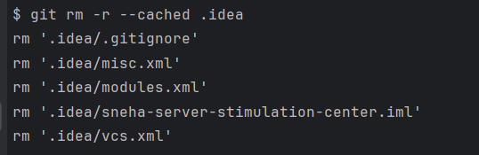

# sneha-server-stimulation-center
This will maintain all my stimulated servers for DevOps + SysAdmin + full stack developer learning 

## What am I trying to achieve in this path ?
Well list is long, and not very concrete at the moment hence I am jotting all my pointers here
1. BOX-style full serve in docker: Will make 4 docker containers(stimulating 4 server 2 SIT and 2 PROD)
2. in these 4 box itself everything will reside like backend, frontend, db, messaging bus, zookeeper, logs..
3. DEV1 we will start with a simple Linux server and build everything on this manually.
4. While for other server we will make dockerfile with all the steps

.gitignore was not added pehle se in repo, and .idea dir with it's content got cached in git commits
so, wht to do in this case ? 
inside terminal, paste cmd:
$ git rm -r --cached .idea

